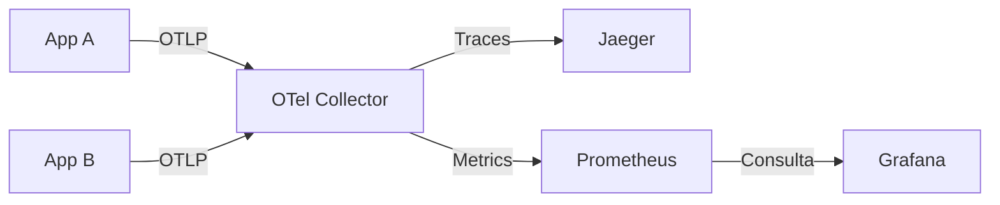

# 📊 Observabilidade com OpenTelemetry, Jaeger, Prometheus, Grafana e Apps Java

Este repositório contém uma stack completa de observabilidade utilizando **Docker Compose**.  
O ambiente demonstra a instrumentação de aplicações **Java 17** e a visualização de dados telemétricos (**Traces** e **Métricas**) utilizando o **OpenTelemetry** como base.

---

## 🧩 Stack de Observabilidade

O ambiente inclui:

- **Jaeger** – Visualização de *traces* distribuídos.
- **OpenTelemetry Collector** – Pipeline central de ingestão, processamento e exportação de dados.
- **Prometheus** – Banco de dados de séries temporais para armazenamento de métricas.
- **Grafana** – Criação de dashboards e visualização de métricas.
- **App A e App B (Java 17)** – Aplicações de exemplo instrumentadas via OpenTelemetry SDK.

---

## 🚀 Como Executar o Projeto

### 🟦 1. Pré-requisitos

Certifique-se de ter instalado em sua máquina:

- [Docker](https://docs.docker.com/get-docker/)
- [Docker Compose](https://docs.docker.com/compose/install/)
- (Opcional) **Java 17**, caso queira rodar os apps localmente fora dos containers.

---

### ▶️ 2. Subindo toda a Stack

Na raiz do projeto, execute o comando para construir as imagens e subir os containers:

```bash
docker compose up --build
```

Ou, para rodar em modo *detached* (segundo plano):

```bash
docker compose up --build -d
```

---

## 🌐 Serviços e Portas

A stack iniciará os seguintes serviços:

| Serviço        | URL / Porta             | Descrição                    |
|----------------|-------------------------|------------------------------|
| **Jaeger UI**  | http://localhost:16686  | Visualização de traces       |
| **Prometheus** | http://localhost:9090   | Consulta de métricas cruas   |
| **Grafana**    | http://localhost:3000   | Dashboards de observabilidade|
| **App A**      | http://localhost:8081   | Aplicação frontend / entrypoint |
| **App B**      | http://localhost:8082   | Aplicação backend            |
| **OTel Collector** | `4317` (gRPC), `4318` (HTTP), `8889` | Ingestão e exportação OTLP |

---

## 🔍 3. Acessando as Ferramentas

### 🟣 Jaeger (Visualização de Traces)

1. Acesse: http://localhost:16686  
2. No menu lateral **Service**, selecione `appA` ou `appB`.  
3. Clique em **Find Traces** para explorar:
   - *Spans*
   - Dependências entre serviços
   - Tempo de resposta de cada chamada

---

### 📈 Grafana (Dashboards)

1. Acesse: http://localhost:3000  
2. Login padrão:

   - Usuário: `admin`  
   - Senha: `admin`

3. Configuração inicial (caso não esteja automatizada):

   - Vá em **Configuration > Data sources > Add data source**.
   - Selecione **Prometheus**.
   - Em **URL**, informe: `http://prometheus:9090` (comunicação interna no Docker).
   - Salve e teste a conexão.

Depois disso, você pode criar dashboards ou importar dashboards prontos para visualizar as métricas coletadas.

---

### 📊 Prometheus (Métricas cruas)

1. Acesse: http://localhost:9090  
2. Utilize a barra de busca para pesquisar métricas exportadas pelo OpenTelemetry Collector e pelas aplicações Java.  
   Exemplos de consultas:
   - `otelcol_processor_batch_batch_send_size`
   - `http_server_requests_seconds_count`
   - `jvm_memory_used_bytes`

---

## 🧪 4. Gerando Traces e Métricas

Para ver os dados fluindo, é necessário gerar tráfego nas aplicações.

Chame o **App A** para iniciar uma requisição que fará chamadas encadeadas ao **App B**:

```bash
curl http://localhost:8081/algum-endpoint
```

> Ajuste o endpoint conforme a implementação do App A (por exemplo, `/api/test`, `/hello`, etc).

### Fluxo gerado

1. **App A** recebe a requisição HTTP.
2. **App A** chama o **App B** internamente.
3. Ambos geram **spans** e **métricas** via OpenTelemetry SDK.
4. O **OpenTelemetry Collector** recebe os dados via OTLP.
5. O Collector envia:
   - **Traces** → para o **Jaeger**.
   - **Métricas** → para o **Prometheus**.
6. O **Grafana** consulta o **Prometheus** e exibe visualizações.

---

## 🔧 5. Arquitetura do Ambiente

O fluxo de dados segue o padrão **OTLP (OpenTelemetry Protocol)**:



Resumo do fluxo:

- Apps Java enviam **traces** e **métricas** via **OTLP/gRPC** para o Collector.
- O **Collector** processa, filtra e roteia os dados:
  - **Traces → Jaeger**
  - **Métricas → Prometheus**
- O **Grafana** consulta o Prometheus para visualização de métricas.

---

## 🔄 6. Comandos Úteis

Parar os serviços:

```bash
docker compose down
```

Parar e apagar volumes (limpa os dados do Prometheus/Grafana):

```bash
docker compose down -v
```

Subir novamente (reconstruindo imagens):

```bash
docker compose up --build
```

Ver logs de um serviço específico:

```bash
docker compose logs -f <nome-do-servico>
# Ex.: docker compose logs -f appA
```

---

## 📁 7. Estrutura do Projeto

```text
/
├── docker-compose.yml          # Orquestração dos containers
├── otel-collector-config.yaml  # Configuração do pipeline do OpenTelemetry Collector
├── prometheus.yml              # Configuração do Prometheus (scrape, jobs etc.)
├── appA/                       # Código fonte do microsserviço A (Java)
│   └── (código Java)
├── appB/                       # Código fonte do microsserviço B (Java)
│   └── (código Java)
└── README.md                   # Documentação do projeto
```

> Os diretórios `appA` e `appB` incluem a instrumentação com OpenTelemetry SDK (traces e métricas).

---

## 🧱 8. Tecnologias Usadas

- **Jaeger**: `1.60`
- **OpenTelemetry Collector**: `0.110`
- **Prometheus**: `latest`
- **Grafana**: `latest`
- **Linguagem**: `Java 17` + **OpenTelemetry SDK**
- **Containerização**: Docker + Docker Compose

---
